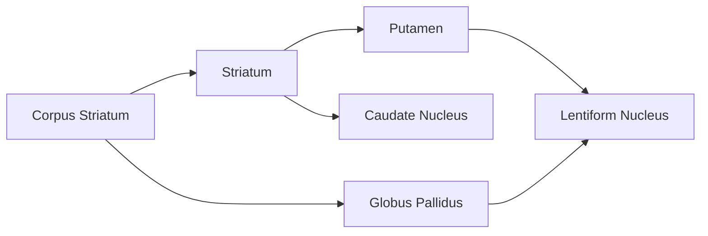
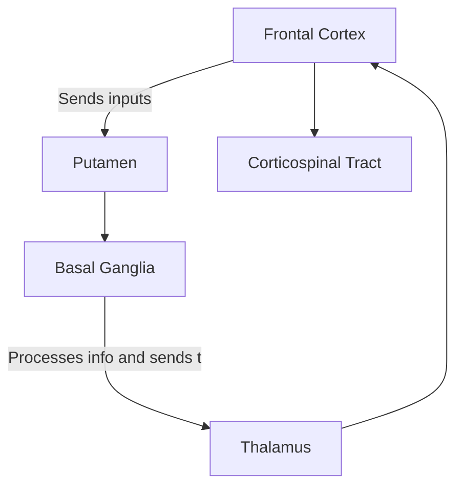

---
{"dg-publish":true,"permalink":"/pages/basal-ganglia/"}
---

- Represents massive subcortical nuclei <mark style="background: #D2B3FFA6;">derived from the telencephalon</mark> 
# Anatomy

- Composed of gray matter
- The **striatum** is the ==receptive== component especially the [[Putamen\|Putamen]]
- The internal segment of the [[pages/Globus Pallidus\|Globus Pallidus]] is the ==main output== structure 
- The **corpus striatum** is the combination of the lentiform nucleus and the striatum
	- Concerned with ==somatic motor== function
	- **Neostriatum** is composed of the ==caudate nucleus and [[Putamen\|Putamen]]==
	- **Paleostriatum** is the [[pages/Globus Pallidus\|Globus Pallidus]]
- The **amygdaloid nuclear complex** is part of the [[pages/Limbic System\|Limbic System]] 
	- **Archistriatum** is the oldest part of the basal ganglia
	- Concerned with ==visceral, endocrine, and behavioral== function
# Functions
- Enables the automatic performance of ==learned== motor acts and ==postural== adjustments
	- Provides selective reinforcement by <mark style="background: #D2B3FFA6;">broad inhibition of competing motor mechanisms</mark> 
	- Essentially acting as a ==continuous brake== in motor programming
	- Controls and regulates activities of the **motor and premotor cortex** in order for voluntary movements to be performed smoothly
- Receives input from the cortex and project back principally to areas of the frontal cortex for motor planning
# Mechanism

# Disorders
- [[pages/Parkinson's Disease\|Parkinson's Disease]]
- [[pages/Chorea\|Chorea]] 
- [[pages/Athetosis\|Athetosis]] 
- [[pages/Hemiballismus\|Hemiballismus]]